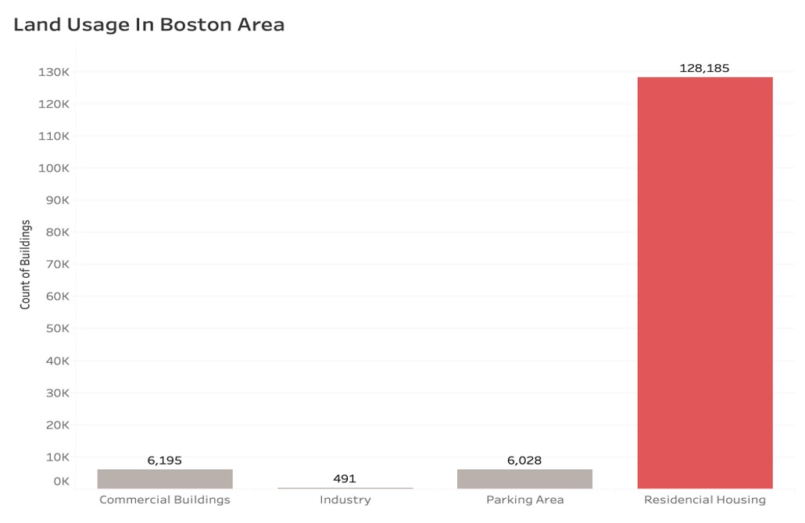

# Data_Visualization
Analyzing trend of Boston real estate using Tableau

Link for the project data set and dictionary are as follows - 

https://data.boston.gov/dataset/e02c44d2-3c64-459c-8fe2-e1ce5f38a035/resource/695a8596-5458-442b-a017-7cd72471aade/download/fy19fullpropassess.csv

https://data.boston.gov/dataset/e02c44d2-3c64-459c-8fe2-e1ce5f38a035/resource/bac18ae6-b8fd-4cd3-a61c-c5e1a11f716c/download/property-assessment-fy2019-data-key.pdf

Scope: To explore Boston real estate trend and to identify upcomming, most preferred neighbourhood in the city.

The problem will be explored in following stages:

Case Introduction

Outcome methods

Conclusion

Reference

----------------------------------------

