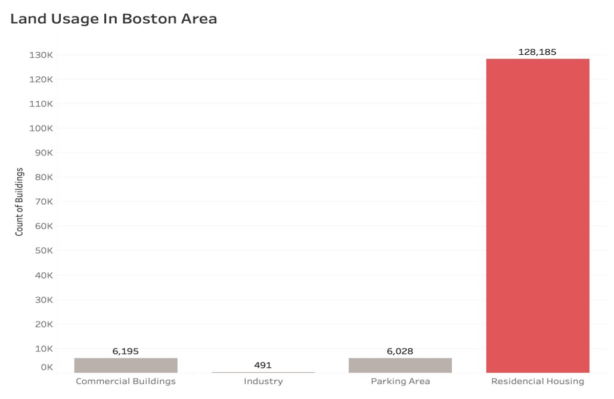
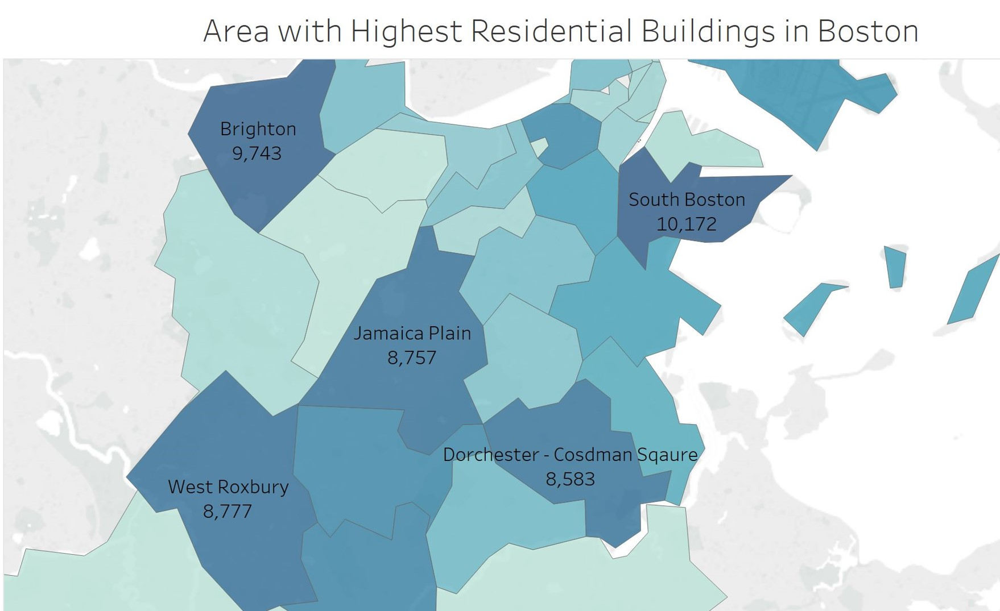
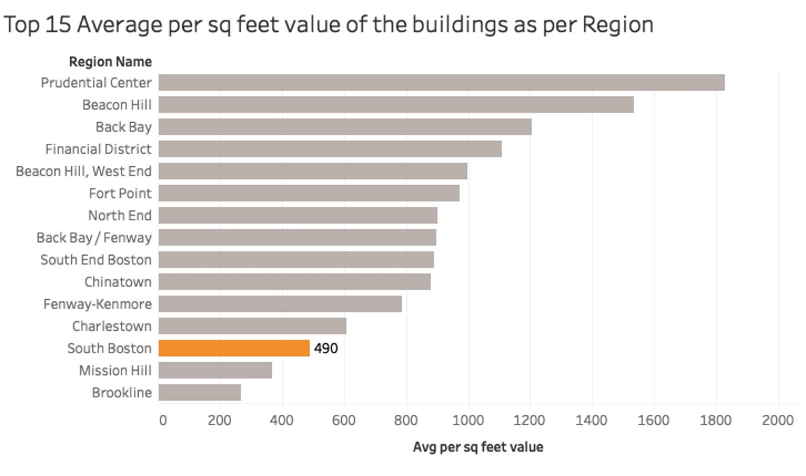
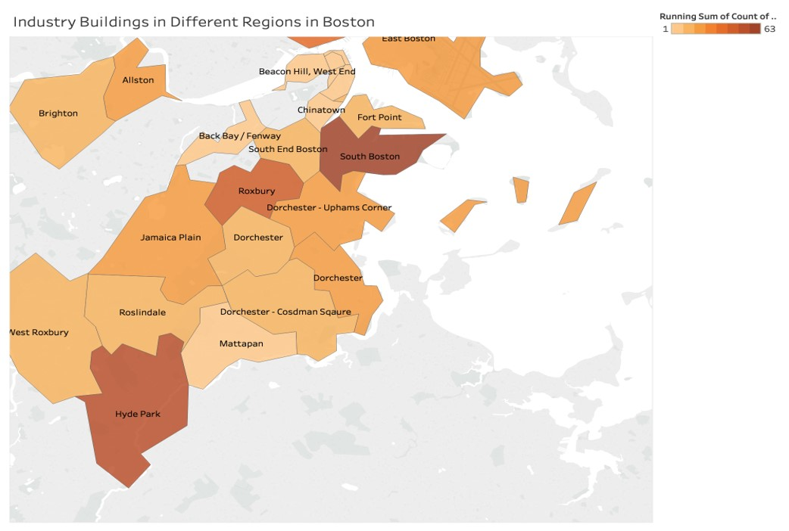
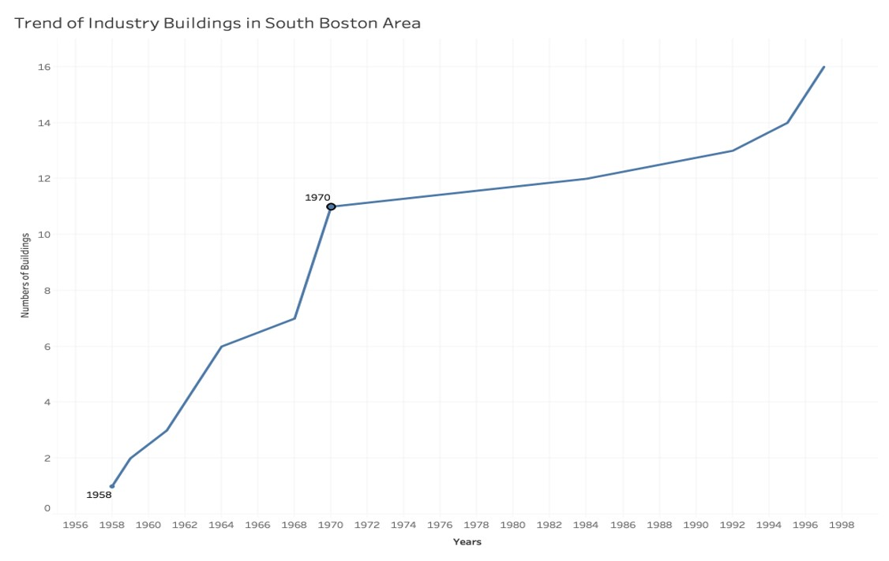
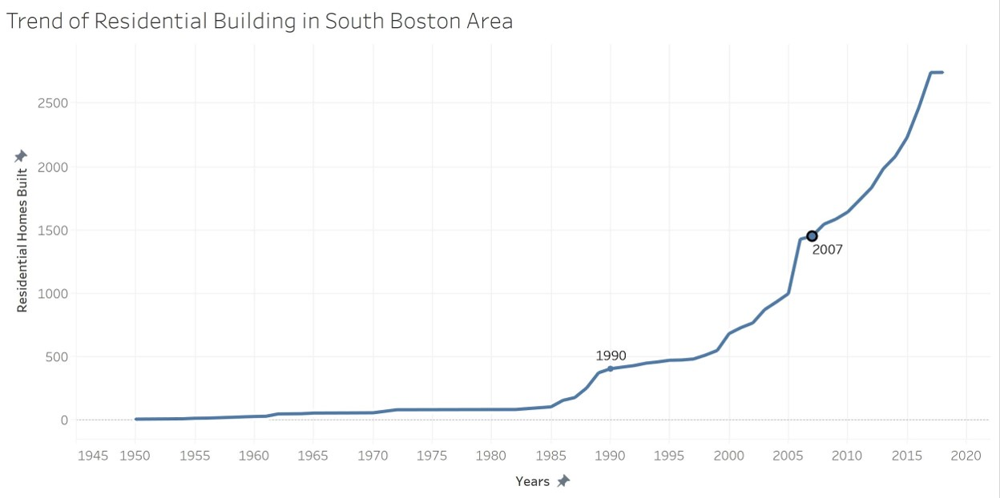
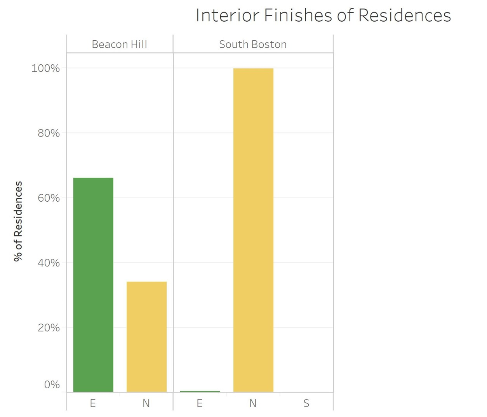
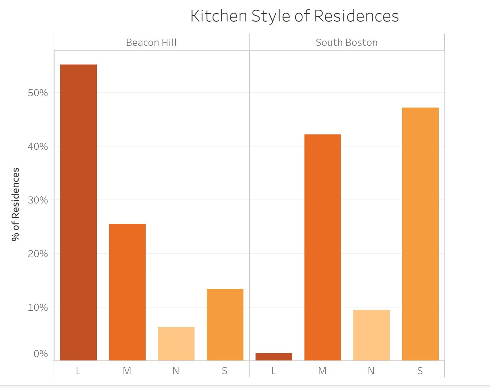
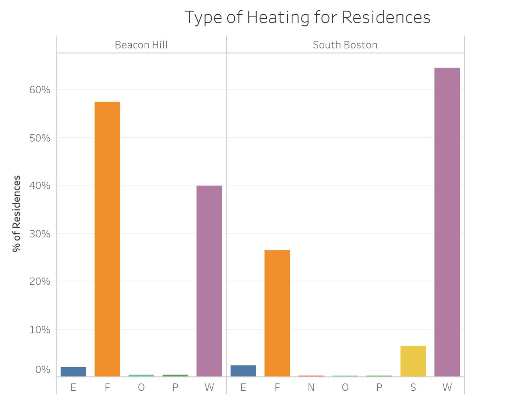
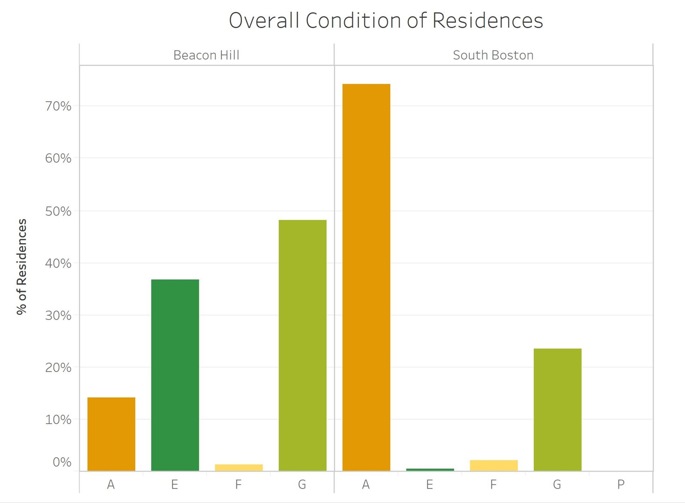

# Data_Visualization
Analyzing trend of Boston real estate using Tableau

Link for the project data set and dictionary are as follows - 

https://data.boston.gov/dataset/e02c44d2-3c64-459c-8fe2-e1ce5f38a035/resource/695a8596-5458-442b-a017-7cd72471aade/download/fy19fullpropassess.csv

https://data.boston.gov/dataset/e02c44d2-3c64-459c-8fe2-e1ce5f38a035/resource/bac18ae6-b8fd-4cd3-a61c-c5e1a11f716c/download/property-assessment-fy2019-data-key.pdf

Scope: To explore Boston real estate trend and to identify upcomming, most preferred neighbourhood in the city.

The problem will be explored in following stages:

Case Introduction

Outcome methods

Conclusion

Reference

----------------------------------------

Boston being one of the oldest cities founded in 1630, is home to around 7,000,000 people making Boston real estate market rather large on it’s own. Being an educational hub.

It attracts large number of students which occupy 20% of the total population and 50% of the total population consists of Working professionals, this leads to high demand for residential buildings in Boston. Also, by creating this bar chart, which collecting the count of different types of buildings, we can see that the residential housing occupy almost all of the land use of Boston. 

This map shows the top 5 residential building count in Boston. We have purposely highlighted 5 top regions having the highest count of residential buildings as the values are close to each other. 

South boston has the highest count leaving behind other prominent areas which are close to the residential structure count of South Boston. This is the  main graph that is going to lead us closer to aswering our business question, we now see why people tend to occupy a residence in South Boston.

It is surprising to know that South Boston being near to Downtown area has the highest residential count whereas, other areas such as Brighton or Jamaica Plain are predominantly residential have slightly less count.

The first thing anyone would consider while purchasing a house is the price so we considered the price element. We created a Horizontal bar graph that shows Average Top 15 sq. feet value of the buildings as per the region. 

As you can see that the per sq feet value of residential buildings is 490 which is not that high compared to other neighboring regions. Also China Town, Beacon Hill and South End boston are neighboring regions of South Boston. But the average price per sq feet is higher in those areas compared to South Boston. 

This map shows us where the Industries are mostly located in Boston. South Boston, which is close to Downtown and is a favourable location has surprisingly highest number. This may have a high influence on people considering this area which is located at a prime location having accessibility to public transport and offices. 

While researching more about why South Boston has more number of Industries, we find a high growth from 1960 to 1970. These years are considered as the “Years of Change” for the American Economy with the Industrial revolution. High  number of Industries were built along the coast of Boston. 

The after effects of the rise in Industry impacted the residential growth from 1980 to 2010, where we see a drastic increase in new residential building development in South Boston. Comparatively low per square feet value as mentioned earlier helped people choose this location. 

We try to compare Beacon Hill with South Boston, as it is considered as one of the prime residential locations in Boston. As per the per square feet price difference, we want to understand few important features of residence which one may look for while opting to live in that place.

E- Elaborate | N - Normal | S - Sub Standard

We compare the interior finishes where we find

-----------------------------------------------------------------------
Conclusion

--> Highest residential buildings 

--> Average square Feet value

--> Commercial and industrial Zone

--> Preferred by Millenials

South Boston is home to both long-time residents and a new wave of young professionals who are drawn to the area’s open space, emerging nightlife, and easy access to downtown. 

The neighborhood boasts beaches and waterfront parks including Carson Beach, L Street Beach, Pleasure Bay, and the Strandway. 

